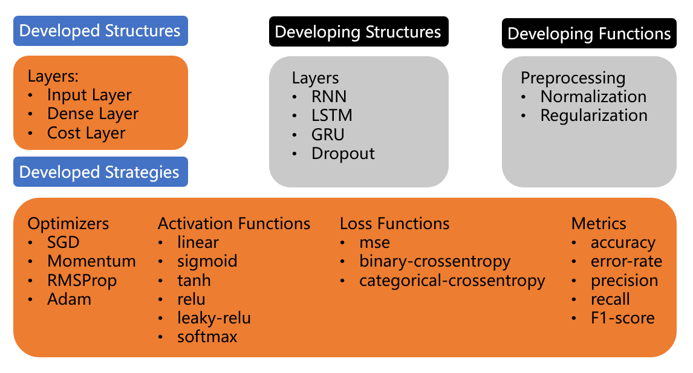
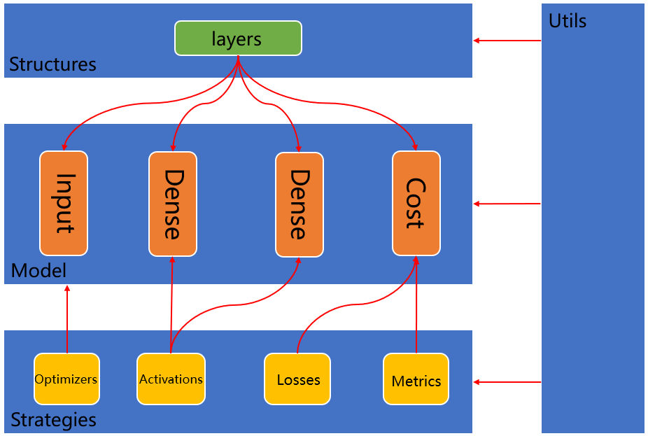
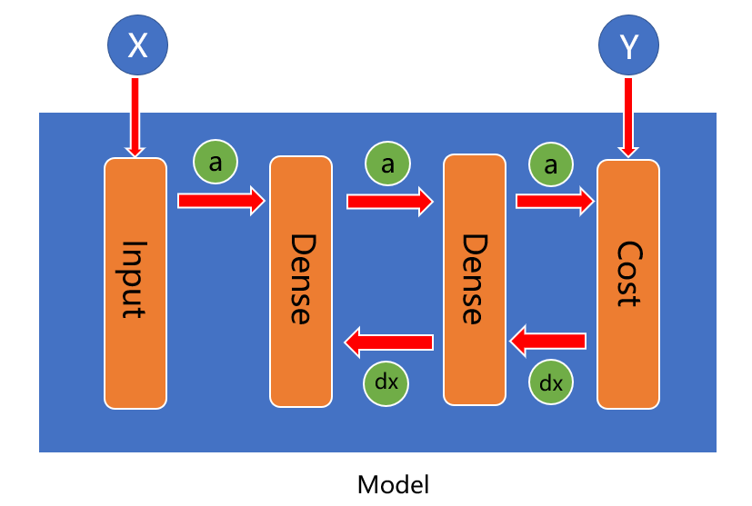

# SenKuu —— Deep Learning for beginners
<p>
    
</p>

   

## Welcome
基于 NumPy 的深度学习模型开发框架，通过搭积木的方式来组装神经网络模型。API 借鉴了 Keras 的设计。

## License
  
<br/>
Senkuu is distributed under the Apache license 2.0.

## Getting started: 10 seconds to SenKuu
``` python
from senkuu.model import Model
from senkuu.structures.layers import Input, Dense

model = Model()
model.add(Input(units=2))  # The first layer must be Input layer
model.add(Dense(units=3, activation='tanh'))
model.add(Dense(units=1, activation='sigmoid'))

model.set(loss='binary_crossentropy', optimizer='adam',  
          metrics=['acc', 'precision', 'recall', 'f1'])

model.train(train_x, train_y, epochs=100, validation=0.2)

loss, score = model.test(test_x, test_y)
print(loss, score)

model.predict(new_x, onlyclass=True)
```

## Installation
There are two ways to install Senkuu:  
* (**Recommended**) install SenKuu from PyPI:  
``` shell
$ pip install senkuu
```

* (**Alternatively**) install SenKuu from GitHub source:
``` shell
$ git clone https://github.com/techrc/senkuu.git
```

## Developed & Developing Functions
<p>
    
</p>

## Architecture
<p>
    
</p>

## Data Flow
<p>
    
</p>

## Why this name, SenKuu?
<p>
    
</p>

Here is Senkuu, senkuu from **《Dr.Stone》**
